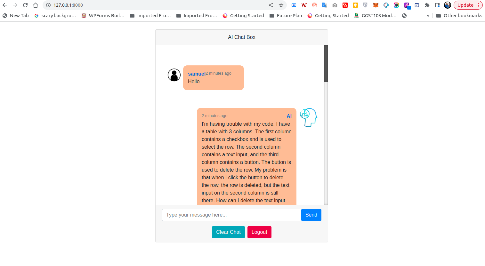
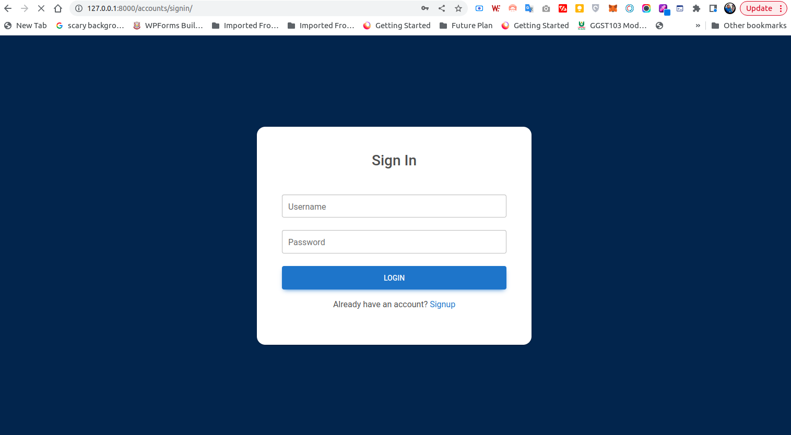
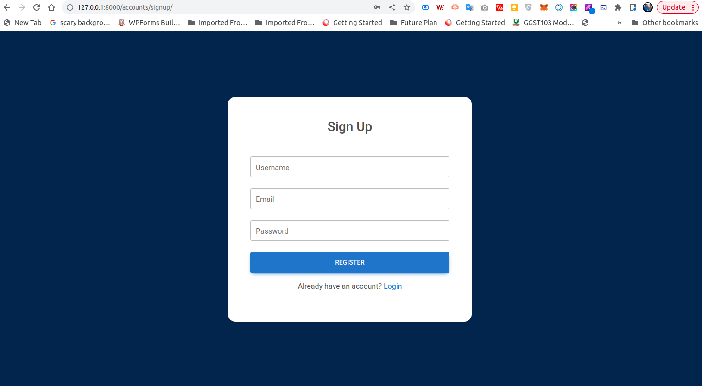

<pre><code>     _  _                                    _ 
  __| |(_)__ _ _ _  __ _ ___   _ __ _ _ ___ (_)___ __| |_ 
 / _` || / _` | ' \/ _` / _ \ | '_ \ '_/ _ \| / -_) _|  _|
 \__,_|/ \__,_|_||_\__, \___/ | .__/_| \___// \___\__|\__|
     |__/          |___/      |_|         |__/            
</code></pre>

A AI Chat Bot Website.






Features
--------

* User Authentication
* Artificail Intelligence Chat 
* Clear Chat
* Logout


Requirements
------------

* [Django](https://www.djangoproject.com/download/)
* [virtualenv](http://www.virtualenv.org/en/latest/)
* [Requests](https://pypi.org/project/requests/)

Getting started
---------------
Clone Repository
'''bash
$ git clone https://github.com/Ayomisco/AI-chat-bot.git
'''

Change Directory to Project File
'''bash
$ cd optistud
'''

Create a virtual enviroment to work inside.

```bash
$ virtualenv my-environment
```

Jump in and turn it on.

```bash
$ cd my-environment
$ . bin/activate
```

Install modules in requirements.txt.

```bash
$ pip install -r requirements.txt
```

Make Migrations.

```bash
$ python manage.py makemigration
$ python manage.py migrate
```
Now that you have setup the project, run it on your local system 

'''bash
$ python manage.py runserver
'''

That is it we're done. Enjoy!!!

